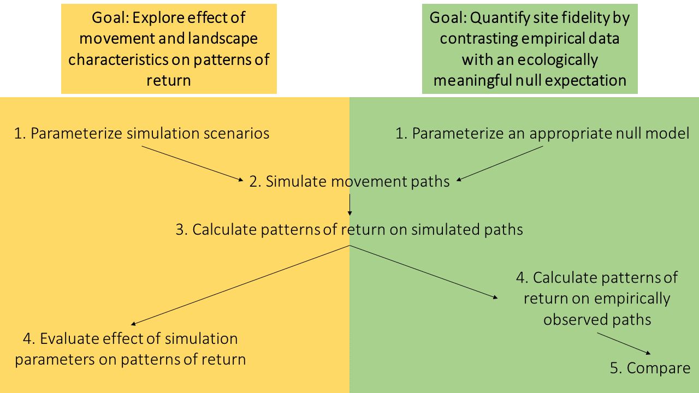

```{r, include = FALSE}
knitr::opts_chunk$set(
  collapse = TRUE,
  comment = "#>",
  fig.align = "center"
)
```

```{r setup}
library(fidelity)
```

## Introduction

The `fidelity` package provides functions to calculate animal site fidelity at
multiple spatio-temporal scales by contrasting observed patterns of return to
ecologically meaningful baseline expectations derived from null, memory-free
movement models. This package is for you if:

* You are interested in exploring the effect of movement parameters and 
landscape characteristics on patterns of return using agent-based simulation;
* You are interested in establishing an ecologically meaningful null expectation
for site fidelity in your study system. 

For more context, please refer to the associated paper: Picardi, S., Abrahms, B., Gelzer, E., Morrison, T., Verzuh, T., Merkle, J. "Defining null expectations for animal site fidelity". Ecology Letters (2022). https://doi.org/10.1111/ele.14148 

Depending on which goal you are after, you will follow one of two possible 
workflows, illustrated in this diagram:

```{r flowchart, echo = FALSE, fig.cap = "", out.width = '100%'}



```

## Goal 1: Explore effect of movement and landscape characteristics on patterns of return

### Step 1: Parameterize simulation scenarios

```{r scenarios crw}

scen_crw <- create_scenarios_crw(rho = c(0, 0.5, 0.99))

```

```{r create landscapes, eval = FALSE}

lands <- sim_land(res = 10, ext = 1000, orig = c("x" = 0, "y" = 0), kappa = c(50, 500), chi = 0.5)

```

```{r load landscapes, echo = FALSE, fig.dim = c(6, 3)}

data(lands)

raster::plot(lands)

```

```{r save landscapes, eval = FALSE}

raster::writeRaster(lands, 
                    filename = "inst/Landscapes/land.tif", 
                    bylayer = TRUE, 
                    suffix = names(lands))

```

```{r name landscapes}

land_names <- paste0("inst/Landscapes/land_",
                     names(lands), 
                     ".tif")

```

```{r scenarios bcrw}

scen_bcrw <- create_scenarios_bcrw(rho = 0.5,
                                   beta = c(0, 0.1, 0.5),
                                   lands = land_names)

```

```{r bind scenarios}

(scen <- rbind(scen_crw, scen_bcrw))

```
 
### Simulate movement paths

```{r neighbors, eval = FALSE}
prange <- 50

neigh <- get_neighbors(lands[[1]], prange = prange)
```

```{r simulate tracks, eval = FALSE}

sim <- simulate_tracks(scenarios = scen,
                       n_steps = 100,
                       n_tracks = 1,
                       start_loc = data.frame(x = 0, y = 0),
                       sl_par = c(1, 20),
                       prange = prange,
                       jitter = FALSE,
                       neighbors = neigh)
)

```

```{r load sims, echo = FALSE}

data(sim)

```

```{r show sims}

head(sim)
tail(sim)

```

```{r plot crw, fig.dim = c(4, 4)}

plot(sim[sim$scenario_id == "CRW_1" & sim$id == 1, ]$x, 
     sim[sim$scenario_id == "CRW_1" & sim$id == 1, ]$y,
     type = "l", xlab = "x", ylab = "y")

```

```{r plot bcrw1, fig.dim = c(4, 4)}

raster::plot(lands[[1]])
lines(sim[sim$scenario_id == "BCRW_2", ]$x, 
      sim[sim$scenario_id == "BCRW_2", ]$y)

```

```{r plot bcrw2, fig.dim = c(4, 4)}

raster::plot(lands[[2]])
lines(sim[sim$scenario_id == "BCRW_4", ]$x, 
      sim[sim$scenario_id == "BCRW_4", ]$y)

```

```{r nrow}

nrow(sim[sim$scenario_id == "BCRW_1", ])
nrow(sim[sim$scenario_id == "BCRW_2", ])
nrow(sim[sim$scenario_id == "BCRW_3", ])
nrow(sim[sim$scenario_id == "BCRW_4", ])
nrow(sim[sim$scenario_id == "BCRW_5", ])
nrow(sim[sim$scenario_id == "BCRW_6", ])

```

### Calculate patterns of return on simulated paths

```{r split sims}

sim_list <- split(sim, f = paste(sim$id, sim$scenario_id))

```

```{r calc rets}

rets <- do.call("rbind", lapply(1:length(sim_list),
                      FUN = function(x) {
                        fidelity::calc_returns(
                          tracks = sim_list[[x]],
                          dist = 10,
                          lag = 10)
                      }))

head(rets, 15)

```

### Evaluate effect of simulation parameters on patterns of return

```{r rho, fig.dim = c(6, 3)}

library(dplyr)
library(ggplot2)

ggplot(rets %>% filter(grepl("CRW", scenario_id)),
       aes(x = step, y = lag_10, color = factor(lag_10))) +
  geom_point() +
  facet_wrap(~ rho) +
  theme_bw() +
  labs(x = "Time step", y = "Return", color = "Return")

ggplot(sim %>% filter(grepl("CRW", scenario_id)),
       aes(x = x, y = y)) +
  geom_path() +
  facet_wrap(~ rho) +
  theme_void()

```

```{r beta kappa50, fig.dim = c(6, 3)}

ggplot(rets %>% filter(scenario_id %in% c("BCRW_1", "BCRW_2", "BCRW_3")),
       aes(x = step, y = lag_10, color = factor(lag_10))) +
  geom_point() +
  facet_wrap(~ beta) +
  theme_bw() +
  labs(x = "Time step", y = "Return", color = "Return")

ggplot(sim %>% filter(scenario_id %in% c("BCRW_1", "BCRW_2", "BCRW_3")),
       aes(x = x, y = y)) +
  geom_path() +
  facet_wrap(~ beta) +
  theme_void()

```

```{r beta kappa500, fig.dim = c(6, 3)}

ggplot(rets %>% filter(scenario_id %in% c("BCRW_4", "BCRW_5", "BCRW_6")),
       aes(x = step, y = lag_10, color = factor(lag_10))) +
  geom_point() +
  facet_wrap(~ beta) +
  theme_bw() +
  labs(x = "Time step", y = "Return", color = "Return")

ggplot(sim %>% filter(scenario_id %in% c("BCRW_4", "BCRW_5", "BCRW_6")),
       aes(x = x, y = y)) +
  geom_path() +
  facet_wrap(~ beta) +
  theme_void()

```

## Goal 2: Quantify site fidelity by contrasting empirical data with an ecologically meaningful null expectation

```{r load mule}

head(mule)

```

### Parameterize an appropriate null model

```{r random}

random_scen <- create_scenarios_crw(rho = 0)

```

### Simulate movement paths

```{r simulate}

sim_null <- simulate_tracks(scenarios = random_scen,
                       n_steps = nrow(mule),
                       n_tracks = 1,
                       start_loc = data.frame(x = mule$X[1], y = mule$Y[1]),
                       sl_par = c(0.6, 330))

```

### Calculate patterns of return on simulated paths

```{r returns null}

ret_null <- fidelity::calc_returns(tracks = sim_null,
                          dist = 50,
                          lag = 12 * 7)

```

### Calculate patterns of return on empirically observed paths

```{r returns observed}

ret_obs <- fidelity::calc_returns(tracks = mule,
                          dist = 50,
                          lag = 12 * 7)

```

### Compare

```{r compare, fig.dim = c(6, 3)}

ret_obs$type <- "Observed"
ret_null$type <- "Null"
ret_null$date <- c(ret_obs$date, NA)
comp_ret <- rbind(ret_obs, ret_null[, c("id", "date", "x", "y", "lag_84", "type")])

ggplot(comp_ret, aes(x = date, y = lag_84, color = factor(lag_84))) +
  geom_point() +
  facet_wrap(~ type) +
  theme_bw() +
  labs(x = "Timestamp", y = "Return", color = "Return")

ggplot(comp_ret, aes(x = x, y = y)) +
  geom_path() +
  facet_wrap(~ type, scales = "free") +
  theme_void()

```
